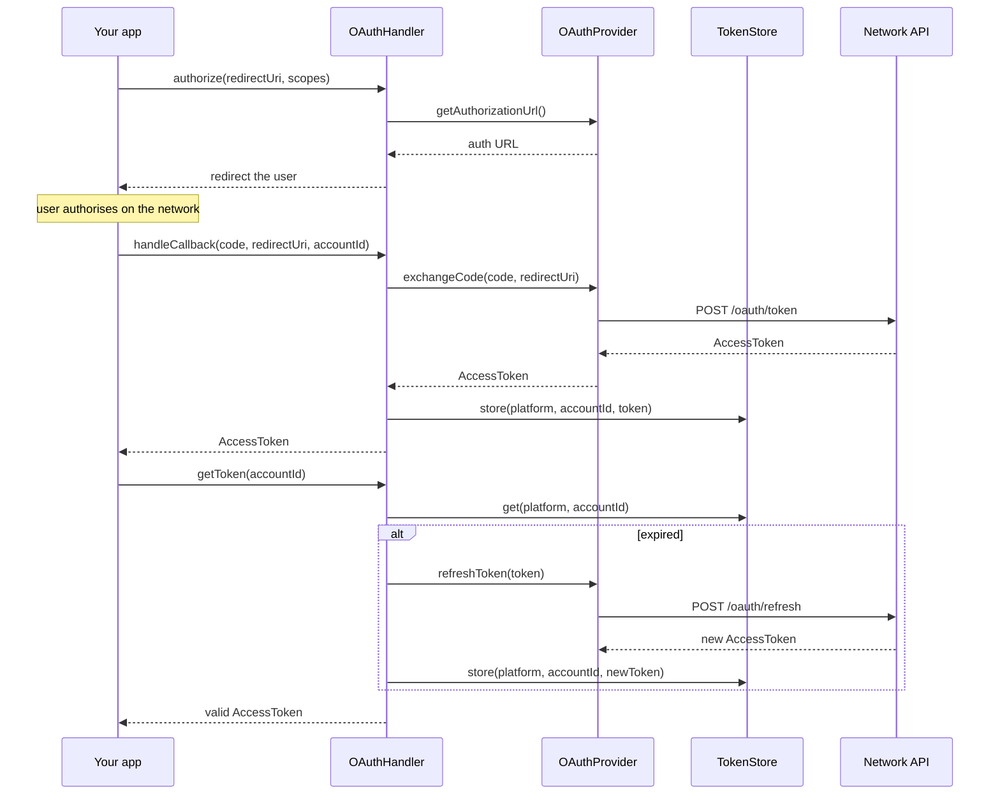

# OAuth

Networks that use OAuth hand you a token that expires. The auth layer handles the exchange and the refresh; you supply the storage.

## OAuthHandler

```php
use Fopost\Core\Auth\OAuthHandler;

$handler = new OAuthHandler($provider, $tokenStore, 'twitter');

// 1. Send the user to the network
$authUrl = $handler->authorize('https://app.com/callback', ['tweet.read', 'tweet.write']);

// 2. They come back with a code
$token = $handler->handleCallback($code, 'https://app.com/callback', 'user-123');

// 3. Later, get a valid token. Refreshes automatically if it expired
$token = $handler->getToken('user-123');
```

`getToken()` is the one to call before publishing. It returns a live token, refreshing and re-storing it if needed, so you never check expiry yourself.



## AccessToken

```php
use Fopost\Core\Auth\AccessToken;

$token = new AccessToken(
    token: 'abc123',
    refreshToken: 'refresh_xyz',
    expiresAt: new DateTimeImmutable('+1 hour'),
    scopes: ['tweet.read', 'tweet.write'],
    metadata: ['user_id' => '12345'],
);

$token->isExpired();      // false
$token->isRefreshable();  // true
```

`isRefreshable()` is false when there is no refresh token. That is not an error state, it is a network that issues long-lived tokens, and it means the only recovery from an expiry is sending the user through authorisation again.

## Token storage is yours

The library defines `TokenStoreInterface` and no implementation, deliberately. Where a credential lives is your decision, not a library's:

```php
use Fopost\Core\Auth\Contracts\TokenStoreInterface;

class DatabaseTokenStore implements TokenStoreInterface
{
    public function get(string $platform, string $accountId): ?AccessToken { /* ... */ }
    public function store(string $platform, string $accountId, AccessToken $token): void { /* ... */ }
    public function revoke(string $platform, string $accountId): void { /* ... */ }
    public function has(string $platform, string $accountId): bool { /* ... */ }
}
```

Encrypt at rest. A stored refresh token is a standing grant to post as that account, and it does not expire the way the access token does.

The `accountId` is yours: whatever identifies the user or account in your system. It is how one store serves many users on the same network.

The framework packages ship a store, so Laravel and WordPress users get one without writing it.

## Not every network does this

Telegram uses a bot token that does not expire. Discord and Slack take a webhook URL or a bot token. X uses OAuth 1.0a, whose tokens do not expire either. For those there is nothing to refresh: put the credentials in `PlatformCredentials` and publish.

See [Configure Credentials](/developers/getting-started/connect-platforms) for what each network needs.

## Next

<Cards>
  <Card title="Configure Credentials" href="/developers/getting-started/connect-platforms" />
  <Card title="Platform Credentials" href="./platform-credentials" />
</Cards>
