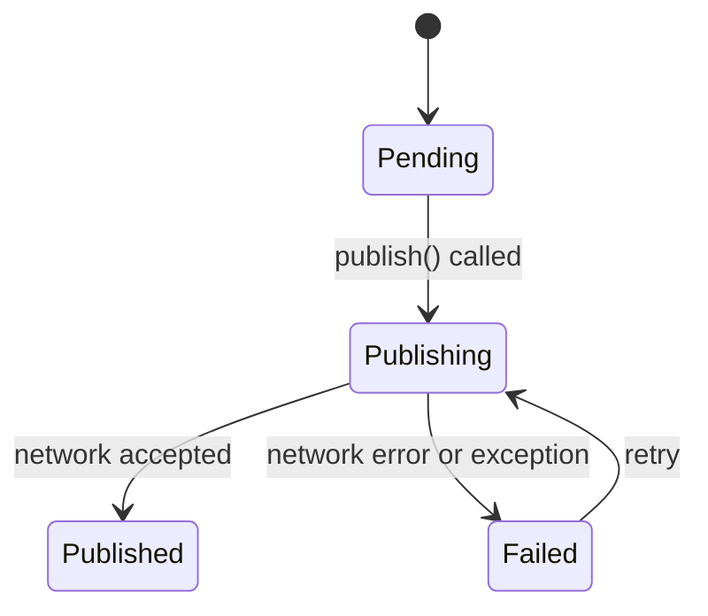

# Delivery Status

The library does not persist anything. `DeliveryStatus` is a backed enum it gives you so your own delivery table speaks the same vocabulary.

```php
use Fopost\Core\Delivery\DeliveryStatus;

DeliveryStatus::Pending;     // 'pending'
DeliveryStatus::Publishing;  // 'publishing'
DeliveryStatus::Published;   // 'published'
DeliveryStatus::Failed;      // 'failed'
```

## Lifecycle



## Tracking it yourself

Record one row per network, before and after:

```php
use Fopost\Core\Delivery\DeliveryStatus;

$delivery = DeliveryRecord::create([
    'post_id'  => $post->getMeta('post_id'),
    'platform' => 'twitter',
    'status'   => DeliveryStatus::Pending->value,
]);

$result = $publisher->publish($post, 'twitter');

$delivery->update([
    'status'       => $result->success
        ? DeliveryStatus::Published->value
        : DeliveryStatus::Failed->value,
    'external_id'  => $result->externalId,
    'external_url' => $result->externalUrl,
    'error'        => $result->error,
    'published_at' => $result->timestamp,
]);
```

Store `externalId` even when you have a URL. It is what a later delete call needs, and it is the field the network will actually recognise.

The tidier place for this is an event listener rather than the call site, so the bookkeeping happens once no matter who publishes. See [Event System](/developers/events/event-system).

## Retries

Nothing retries on its own. `Failed` returns to `Publishing` only because your code put it there.

Check why it failed first. A rate limit deserves a wait and a retry; an authentication failure or content over the limit will fail identically forever, and retrying it on a schedule is how an app gets suspended. See [Error Handling](./error-handling).

## In WordPress and the Cloud

The [WordPress plugin](/sdks/wordpress/installation) keeps its own delivery log with status, error, and a link per attempt, so you get this without building it.

The [Cloud API](/api/publishing) tracks deliveries per account with attempt counts, automatic retries, and [webhooks](/api/webhooks) on the outcome.

## Next

<Cards>
  <Card title="Publishing" href="./publishing" />
  <Card title="Error Handling" href="./error-handling" />
  <Card title="Event System" href="/developers/events/event-system" />
</Cards>
