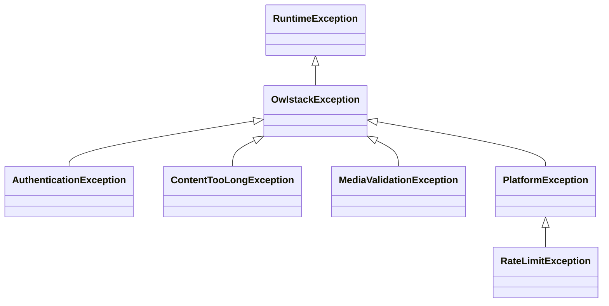

# Error Handling

Two layers, and which one you meet depends on how you call things.

**Through the `Publisher`**, nothing throws. Every failure comes back as a `PublishResult` with `success` false and an `error` string. This is what you want almost always.

**Calling a platform directly**, you get typed exceptions. Reach for this when you need to distinguish a rate limit from a bad token programmatically, rather than reading a message.

## The hierarchy



| Exception | Means | Carries |
|:----------|:------|:--------|
| `OwlstackException` | Base for everything the library raises | |
| `AuthenticationException` | Credentials invalid or expired | |
| `ContentTooLongException` | Content over the network's limit | `platformName`, `maxLength`, `actualLength` |
| `MediaValidationException` | Media the network will not take | `platformName`, `mimeType`, `fileSize` |
| `PlatformException` | The network's API returned an error | `platformName`, `httpStatusCode`, `apiErrorCode`, `rawResponse` |
| `RateLimitException` | Rate limited | `retryAfter`, `retryAfterSeconds()` |

Everything extends `RuntimeException`, so a single `catch (OwlstackException $e)` covers the library without swallowing unrelated failures.

## Catching directly

```php
use Owlstack\Core\Exceptions\ContentTooLongException;
use Owlstack\Core\Exceptions\MediaValidationException;
use Owlstack\Core\Exceptions\RateLimitException;

try {
    $response = $platform->publish($post);
} catch (RateLimitException $e) {
    sleep($e->retryAfterSeconds() ?? 60);
    // retry
} catch (ContentTooLongException $e) {
    echo "Content is {$e->actualLength} chars, max {$e->maxLength} on {$e->platformName}";
} catch (MediaValidationException $e) {
    echo "Cannot use {$e->mimeType} on {$e->platformName}";
}
```

## What to do about each

| Failure | Response |
|:--------|:---------|
| `RateLimitException` | Wait `retryAfterSeconds()`, then retry. Do not retry immediately |
| `AuthenticationException` | Do not retry. The token needs refreshing or the app reauthorising |
| `ContentTooLongException` | Do not retry the same content. Shorten it, or let the formatter truncate |
| `MediaValidationException` | Do not retry. Convert or drop the attachment |
| `PlatformException` | Depends on `httpStatusCode`. A 5xx is worth one retry, a 4xx is not |

Retrying an authentication failure on a loop is how you get an app suspended. Check the type before backing off.

## Diagnosing a failure through the publisher

`PublishResult::$error` is a string, which is enough to log and show a user but not enough to branch on. When you need structure, subscribe to `PostFailed` and inspect the result there, or call the platform directly for that one case.

`PlatformException::$rawResponse` holds the network's own body, which is usually where the real reason is.

## Next

<Cards>
  <Card title="Publishing" href="./publishing" />
  <Card title="Delivery Status" href="./delivery-status" />
  <Card title="Event System" href="/developers/events/event-system" />
</Cards>
