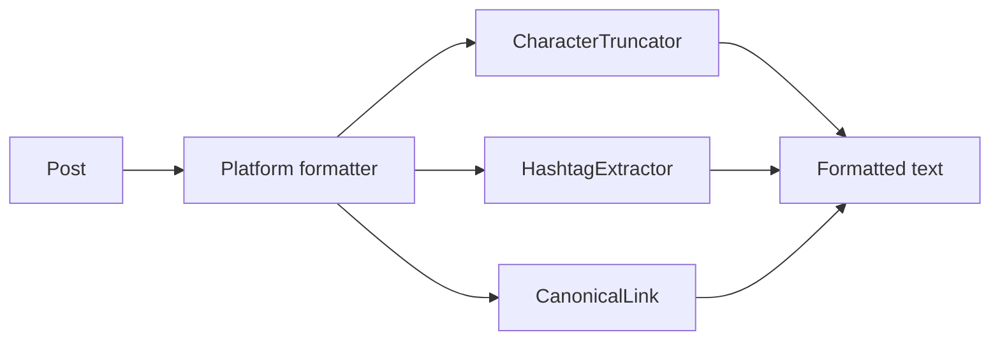

# Platform Formatters

A formatter turns a platform-agnostic `Post` into the string one network wants. Every network has its own, implementing `FormatterInterface`.

```php
use Owlstack\Core\Formatting\Contracts\FormatterInterface;

$formatter->format($post, $options);  // the formatted string
$formatter->platform();               // 'telegram'
$formatter->maxLength();              // 4096
```

You rarely call one directly. The platform does it during `publish()`.

## What a formatter handles

- **Character limits**, truncating on a word boundary rather than mid-word
- **Markup**, converting to whatever that network parses
- **Hashtags**, appended in the network's style and position, within the remaining budget
- **URLs**, formatted the way the network expects and counted correctly



## Markup per network

| Network | Markup |
|:--------|:-------|
| Telegram | HTML, or Markdown via `parse_mode` |
| Discord | Markdown |
| Reddit | Markdown |
| Slack | mrkdwn, or Block Kit with `blocks: true` |
| Tumblr | Content blocks |
| X, Facebook, LinkedIn, Instagram, Pinterest | Plain text |

The point of the layer is that you write one `Post` and never think about this.

## Truncation

`CharacterTruncator` cuts on word boundaries:

```php
use Owlstack\Core\Formatting\CharacterTruncator;

$truncator = new CharacterTruncator(ellipsis: '…');
$truncator->truncate('Hello World', maxLength: 8);  // 'Hello…'
```

The ellipsis counts against the limit, so the result is never one character over.

## URLs and the character budget

X wraps every URL to a fixed width regardless of its real length, so a 200-character link costs the same as a short one. Its formatter budgets accordingly. Getting this wrong is the classic way a post is rejected for being over the limit when it looked fine locally.

## Writing your own

Implement `FormatterInterface` and pass it to the platform instead of the built-in one:

```php
class MyTelegramFormatter implements FormatterInterface
{
    public function format(Post $post, array $options = []): string
    {
        return "{$post->title}\n\n{$post->body}";
    }

    public function platform(): string { return 'telegram'; }
    public function maxLength(): int { return 4096; }
}

$platform = new TelegramPlatform($credentials, new HttpClient(), new MyTelegramFormatter());
```

Nothing to fork, and nothing else changes. See [Custom Formatters](/developers/extending/custom-formatters).

## Next

<Cards>
  <Card title="Character Limits" href="./character-limits" />
  <Card title="Hashtag Extraction" href="./hashtag-extraction" />
  <Card title="Custom Formatters" href="/developers/extending/custom-formatters" />
</Cards>
