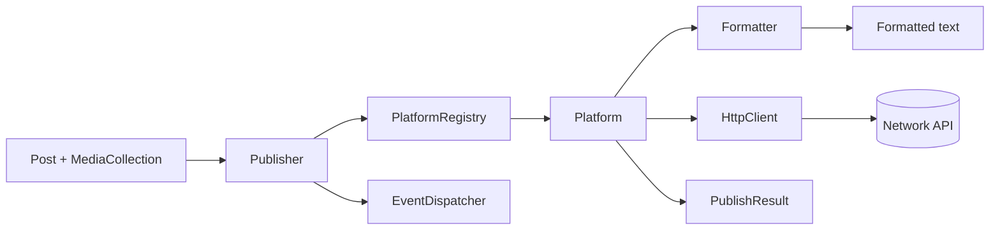

# Architecture

The library is five layers, each behind an interface. Content goes in, a formatter shapes it for one network, a platform calls that network's API, and the publisher returns a result.



## The layers

| Layer | Namespace | What it does |
|:------|:----------|:-------------|
| Content | `Fopost\Core\Content` | `Post`, `Media`, `MediaCollection`, `CanonicalLink`. Immutable, platform-agnostic |
| Config | `Fopost\Core\Config` | `PlatformCredentials`, `FopostConfig`, `ConfigValidator` |
| Formatting | `Fopost\Core\Formatting` | One formatter per network, plus `CharacterTruncator` and `HashtagExtractor` |
| Platforms | `Fopost\Core\Platforms` | One class per network, plus `PlatformRegistry` |
| Publishing | `Fopost\Core\Publishing` | `Publisher` and `PublishResult` |
| Auth | `Fopost\Core\Auth` | `OAuthHandler`, `AccessToken`, and the token store contract |
| Events | `Fopost\Core\Events` | `PostPublished`, `PostFailed`, and the dispatcher contract |
| Http | `Fopost\Core\Http` | A cURL client with no dependencies |
| Support | `Fopost\Core\Support` | `Arr`, `Str`, and a freezable `Clock` |

## Wiring it up

Each platform is constructed with its credentials, an HTTP client, and its formatter. That is three explicit arguments rather than a container, which is what lets the library work with no framework at all.

```php
$httpClient = new HttpClient();

$telegram = new TelegramPlatform(
    new PlatformCredentials('telegram', ['api_token' => '...']),
    $httpClient,
    new TelegramFormatter(),
);

$registry = new PlatformRegistry();
$registry->register($telegram);

$publisher = new Publisher($registry, $eventDispatcher);
```

The [Laravel package](/sdks/laravel/installation) does this wiring for you from config, which is the only thing it adds.

## What is an interface

Anything you might reasonably want to replace:

| Contract | Replace it to |
|:---------|:--------------|
| `PlatformInterface` | Add a network the library does not cover |
| `FormatterInterface` | Change how content is shaped for a network |
| `TokenStoreInterface` | Keep OAuth tokens in your own database |
| `EventDispatcherInterface` | Route events into your framework's dispatcher |
| `OAuthProviderInterface` | Handle a non-standard OAuth flow |

None of these require a fork. See [Extending](/developers/extending/custom-platforms).

## Package layout

| Package | What it is | License |
|:--------|:-----------|:--------|
| `fopost/fopost-social-core` | The engine. Everything above | MIT |
| `fopost/fopost-social-laravel` | Service provider, facade, config, queued events | MIT |
| WordPress plugin | Admin panel, meta boxes, delivery logs, REST endpoints | MIT |

The wrappers hold no platform logic. Anything about how a network behaves lives in core, so a fix reaches Laravel and WordPress at the same time.

## Next

<Cards>
  <Card title="Publishing" href="/developers/core-concepts/publishing" />
  <Card title="Custom Platforms" href="/developers/extending/custom-platforms" />
  <Card title="Event System" href="/developers/events/event-system" />
</Cards>
